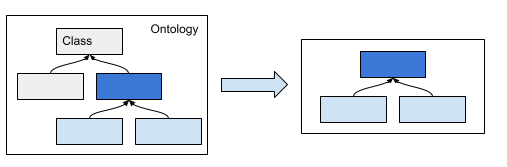
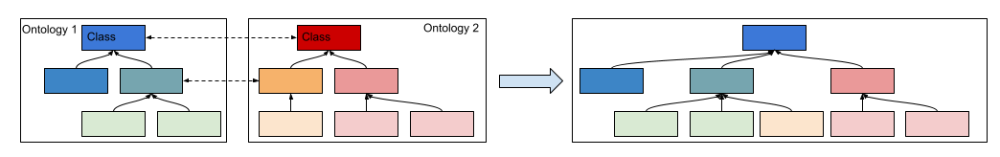

# FBBI - EDAM mapper
This contains code & data (from ontologies) to attempt to map classes from one taxonomy to another, and place unmapped classes in the correct point in the taxonomy.

The main focus of this code was the FBBI (https://ontobee.org/ontology/FBbi) and EDAM (https://ontobee.org/ontology/EDAM) ontologies, but should be possible to generalise to deal with other ontolgies.

## Installation

Using poerty, run `poetry init` to create a virtual enviroment with all required dependencies.

Can then run the individual scripts within your virtual env (as you would run a script, e.g. python3 /path/to/script.py) - there isn't a command line option.

## Script 1: ontology_comparison.py

This script takes two ontologies and compares lables and other string naming to propose which classes might be equivalent.

## Script 2: filter_taxonomy.py

This script takes ontologies and a starting class, and returns all statements in the ontology for the classes below (& including) the class in the taxonomic hierarchy. Writes out the new taxonomic hierarchy in ttl. Does not handle restriction classes used in the class hierarchy.

## Script 3: mapping.py

Using direct mappings in the mapping tsv (in mapping/ directory) finds the unmapped classes that are children of mapped classes, and reparents them into a new taxonomy. Outputs ttl of new ontology definition.

## Script 4: mapping_viz.py
Takes a ttl file, creates a hierarchy of Nodes, and renders the graph of the taxonomies. Shows the combined tree colour coding classes based on their original ontology.
